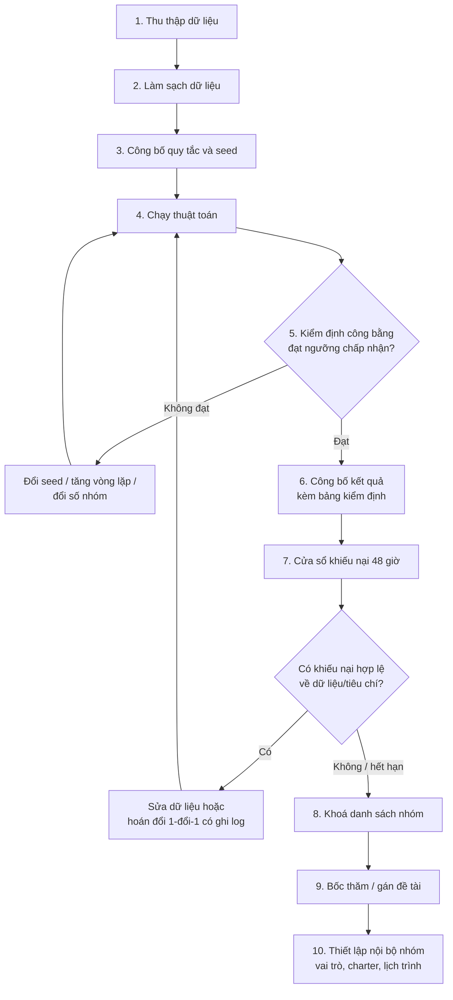
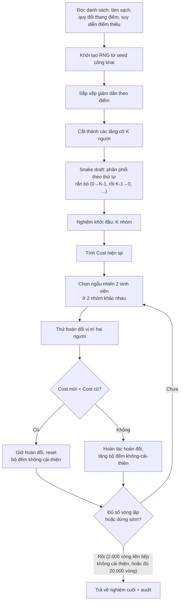
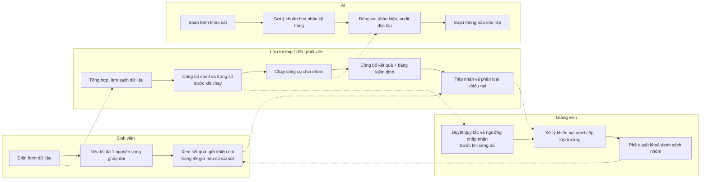

# Phân tích thiết kế và quy trình chia nhóm công bằng

## 1. "Công bằng" nghĩa là gì?

Có ba kiểu công bằng khác nhau, và một hệ thống chia nhóm tốt phải biết mình đang tối ưu cho kiểu nào trước:

| Kiểu công bằng | Nghĩa là gì | Ví dụ trong bối cảnh chia nhóm |
|---|---|---|
| **Thủ tục (procedural)** | Quy trình ra quyết định minh bạch, có quy tắc công khai trước, áp dụng như nhau cho mọi người, không ai có đặc quyền can thiệp tay | Seed và trọng số được công bố trước khi chạy; thuật toán là quyết định, không phải cảm tính của lớp trưởng |
| **Phân phối (distributive)** | Kết quả cuối cùng — tài nguyên/gánh nặng — được chia đều theo tiêu chí đã thống nhất | Mỗi nhóm có GPA trung bình gần bằng nhau, không có nhóm nào "toàn học sinh giỏi" hay "toàn học sinh yếu" |
| **Cảm nhận (perceived)** | Người trong cuộc *cảm thấy* mình được đối xử công bằng, bất kể quy trình hay kết quả khách quan thế nào | Sinh viên tin rằng không ai bị "cài" vào nhóm yếu; có cửa sổ khiếu nại; có lời giải thích khi kết quả trông bất thường |

**Hệ thống này ưu tiên công bằng thủ tục trước tiên.** Lý do: công bằng phân phối là thứ máy tính đo được và tối ưu trực tiếp (đó là việc File 2 làm), nhưng nếu quy trình không minh bạch — không ai biết seed là gì, không ai biết trọng số ra sao, kết quả có thể bị chỉnh tay sau đó — thì dù phân phối có đẹp đến mấy, sinh viên vẫn nghi ngờ có sự thiên vị. Công bằng thủ tục (seed công khai, quy tắc công khai trước khi chạy, log mọi thay đổi thủ công) là nền tảng để công bằng phân phối được *tin*, và công bằng phân phối tốt lại là nguyên liệu chính để tạo ra công bằng cảm nhận. Nói cách khác: thủ tục đúng → phân phối đo được → cảm nhận tốt theo sau, chứ không đi ngược lại.

## 2. Vì sao chọn ba trục cân bằng: năng lực, giới tính, kỹ năng

- **Năng lực (GPA/điểm số):** Nếu không cân bằng, một nhóm sẽ gánh phần lớn công việc phân tích/tư duy khó trong khi nhóm khác "rảnh rang" — không công bằng về khối lượng công việc thực tế, và điểm đồ án cuối kỳ sẽ phản ánh sai năng lực làm việc nhóm.
- **Kỹ năng/chuyên môn:** Một đồ án cần nhiều loại việc (phân tích, viết, thuyết trình, thiết kế, điều phối). Nhóm thiếu hẳn một kỹ năng cốt lõi sẽ phải học từ số 0 hoặc làm ẩu phần đó.
- **Giới tính:** Đây là trục dễ bị bỏ qua nhất nhưng có bằng chứng hành vi rõ ràng. Quy tắc áp dụng: **tránh mọi nhóm có đúng 1 người thuộc giới tính thiểu số** (chỉ chấp nhận 0, hoặc ≥ 2). Một người duy nhất thuộc giới tính thiểu số trong nhóm có xu hướng bị đẩy vào vai trò thư ký/ghi chép, ít được hỏi ý kiến hơn, và nói ít hơn trong thảo luận — không phải vì năng lực, mà vì động lực nhóm khi ở thế "1 chọi nhiều". Có ≥ 2 người thuộc nhóm thiểu số tạo ra một "khối" đủ để không ai bị cô lập trong vai trò đó.

## 3. Ràng buộc mềm (tuỳ chọn)

- **Tránh lặp lại nhóm cũ:** nếu lớp đã từng làm nhóm cho môn khác, tránh ghép lại y hệt để sinh viên có cơ hội làm việc với người mới — mở rộng mạng lưới hợp tác thay vì đóng khung.
- **Mỗi sinh viên được nêu tối đa 1 nguyện vọng ghép đôi**, không phải 3–4. Lý do: nếu cho phép nhiều nguyện vọng, tổng số ràng buộc "buddy" sẽ dễ mâu thuẫn với các trục cân bằng chính (GPA, giới tính, kỹ năng) và với nhau — 3–4 nguyện vọng/người trong lớp 40 người tạo ra hàng trăm ràng buộc chồng chéo, khiến bài toán tối ưu gần như luôn thất bại ở đâu đó, và biến "sở thích cá nhân" thành yếu tố lấn át tiêu chí công bằng đã thống nhất. Giới hạn 1 nguyện vọng giữ ràng buộc buddy ở mức "thêm gia vị", không phải trụ cột.

## 4. Cảnh báo về dữ liệu cá nhân

GPA và giới tính là dữ liệu nhạy cảm. Trước khi thu thập:

- Cần có sự đồng thuận của lớp (thông báo rõ mục đích sử dụng: chỉ để chia nhóm công bằng, không dùng cho việc khác).
- **Chỉ công bố GPA trung bình của từng nhóm, không bao giờ công bố GPA cá nhân từng người** trong bảng kết quả công khai. Ai cần đối chiếu dữ liệu của chính mình thì hỏi trực tiếp người phụ trách, không hiển thị đại trà.

## 5. Thuật toán: vì sao đây là bài toán NP-hard, và vì sao heuristic là đủ

Chia N sinh viên thành K nhóm sao cho đồng thời tối thiểu hoá phương sai GPA giữa các nhóm, phương sai tỉ lệ giới tính thiểu số, số nhóm thiếu kỹ năng cốt lõi, và tối đa hoá số nguyện vọng ghép đôi được thoả — đây là một dạng **bài toán phân hoạch tập cân bằng đa mục tiêu (multi-objective balanced set partitioning)**, họ hàng với bài toán ba lô (knapsack) và phân hoạch số (number partitioning), vốn đã được biết là NP-hard. Không gian nghiệm có kích thước tổ hợp: số cách chia N người thành K nhóm cùng cỡ tăng theo cấp giai thừa (Stirling number of the second kind nhân với hoán vị nhóm), nên với lớp 40 người chia 8 nhóm, số cách chia đã vượt xa khả năng duyệt toàn bộ (brute-force) của bất kỳ máy tính nào trong thời gian hợp lý.

Tuy nhiên ở quy mô lớp học (thường 20–150 người), **heuristic là đủ** vì:

1. Không cần nghiệm tối ưu tuyệt đối — chỉ cần nghiệm đạt các ngưỡng chấp nhận được đã định nghĩa trước (xem mục 7). Đây là bài toán thoả mãn ràng buộc (constraint satisfaction), không phải bài toán tối ưu hoá học thuật.
2. Kết hợp **snake draft phân tầng** (cho nghiệm khởi đầu tốt, cân bằng GPA gần như ngay lập tức) với **local search dạng hill climbing** (sửa các vi phạm còn sót lại như solo-thiểu-số, thiếu kỹ năng, buddy chưa khớp) hội tụ rất nhanh ở quy mô vài chục đến vài trăm người — vài giây là đủ chạy hàng chục nghìn vòng lặp.
3. Nếu cấu trúc lớp học khiến một số ràng buộc không thể đồng thời thoả mãn (ví dụ lớp chỉ có 1 người biết "Thiết kế" mà chia 8 nhóm), không heuristic nào — kể cả thuật toán tối ưu tuyệt đối — giải quyết được việc đó; đây là giới hạn của dữ liệu đầu vào, không phải của thuật toán.

## 6. Vì sao không để AI tự chia nhóm trực tiếp

Một mô hình ngôn ngữ (LLM) không thực sự "tính toán" phương sai hay tổng hợp một danh sách 40–100 người trong đầu nó — nó dự đoán token tiếp theo dựa trên xác suất ngôn ngữ. Khi được yêu cầu "chia 40 người thành 8 nhóm cân bằng GPA", nó sẽ tạo ra một bảng *trông có vẻ hợp lý* (tên người, số liệu đều đặn) nhưng không có gì đảm bảo tổng/trung bình từng nhóm đã được cộng và chia đúng — với dữ liệu càng dài, xác suất sai số cộng dồn càng cao, và LLM không tự phát hiện ra sai số đó trừ khi được yêu cầu tính lại bằng công cụ.

**Nguyên tắc áp dụng trong toàn bộ hệ thống này: AI xử lý ngôn ngữ, code xử lý số học.** AI dùng để soạn form khảo sát, viết thông báo, đóng vai người phản biện đọc kết quả, gợi ý cách xử lý khiếu nại — tức là các việc liên quan đến diễn đạt và suy luận ngôn ngữ. Việc cộng điểm, tính phương sai, kiểm tra ngưỡng, và thực hiện phép hoán đổi (swap) giữa các nhóm luôn được giao cho code xác định (deterministic), có thể chạy lại và ra đúng một kết quả với cùng một seed.

## 7. Sơ đồ 1 — Luồng tổng thể (10 bước)

## 8. Sơ đồ 2 — Chi tiết bên trong thuật toán

## 9. Sơ đồ 3 — Bơi làn trách nhiệm

## 10. Danh sách kiểm tra trước khi công bố (acceptance threshold)

Phải đạt **tất cả** các mục sau trước khi công bố kết quả cho lớp:

- [ ] Chênh lệch GPA giữa nhóm cao nhất và nhóm thấp nhất < 0.3 (thang điểm 4.0)
- [ ] Không có nhóm nào có đúng 1 người thuộc giới tính thiểu số
- [ ] Mọi nhóm đều có ít nhất 1 người cho mỗi kỹ năng cốt lõi
- [ ] Chênh lệch sĩ số giữa các nhóm ≤ 1 người
- [ ] Seed và toàn bộ trọng số/tiêu chí đã được công bố **trước khi** chạy thuật toán
- [ ] Bảng kiểm định công bằng được công bố **cùng lúc** với danh sách nhóm, không công bố danh sách trước rồi mới giải trình sau

## 11. Bảng các sai lầm thường gặp

| Sai lầm | Hậu quả | Cách khắc phục |
|---|---|---|
| Để sinh viên tự chọn nhóm hoàn toàn | Nhóm hình thành theo quan hệ bạn bè có sẵn, tái tạo bất bình đẳng cũ (nhóm giỏi tự gom lại, nhóm yếu bị dồn về một chỗ) | Chỉ cho phép nêu tối đa 1 nguyện vọng, còn lại thuật toán quyết định dựa trên tiêu chí công khai |
| Bốc thăm/chia hoàn toàn ngẫu nhiên | Phương sai GPA và tỉ lệ giới tính giữa các nhóm rất cao, dễ ra nhóm toàn học sinh yếu hoặc nhóm có 1 người thuộc giới tính thiểu số bị cô lập | Dùng snake draft phân tầng + local search thay vì random thuần |
| Chia nhóm sau khi đã biết đề tài | Sinh viên vận động để vào nhóm có đề tài mình thích, phá vỡ tiêu chí cân bằng đã thống nhất; đồng thời tạo ưu ái ngầm cho ai "quen" người ra đề | Luôn khoá danh sách nhóm trước, sau đó mới bốc thăm/gán đề tài công khai |
| Chỉnh tay kết quả sau khi chạy thuật toán mà không ghi log | Phá vỡ công bằng thủ tục — không ai biết vì sao kết quả cuối khác với kết quả thuật toán đưa ra, dễ bị nghi ngờ thiên vị | Nếu cần chỉnh (ví dụ hoàn cảnh đặc biệt), chỉ thực hiện hoán đổi 1-đổi-1, ghi lại lý do công khai, và chạy lại kiểm định để xác nhận vẫn đạt ngưỡng |
| Công bố GPA cá nhân từng người trong bảng kết quả công khai | Vi phạm quyền riêng tư, gây khó xử cho sinh viên có điểm thấp | Chỉ công bố GPA trung bình theo nhóm |
| Cho phép mỗi người nêu 3–4 nguyện vọng ghép đôi | Quá nhiều ràng buộc chồng chéo khiến thuật toán gần như không bao giờ thoả mãn hết, và biến sở thích cá nhân thành yếu tố lấn át tiêu chí công bằng | Giới hạn tối đa 1 nguyện vọng mỗi người |
| Không công bố seed/trọng số trước khi chạy | Sinh viên không thể kiểm chứng quy trình, mất niềm tin dù kết quả có thể vẫn công bằng về mặt số liệu | Công bố seed và trọng số công khai trước khi chạy, để bất kỳ ai cũng có thể chạy lại và ra cùng kết quả |
